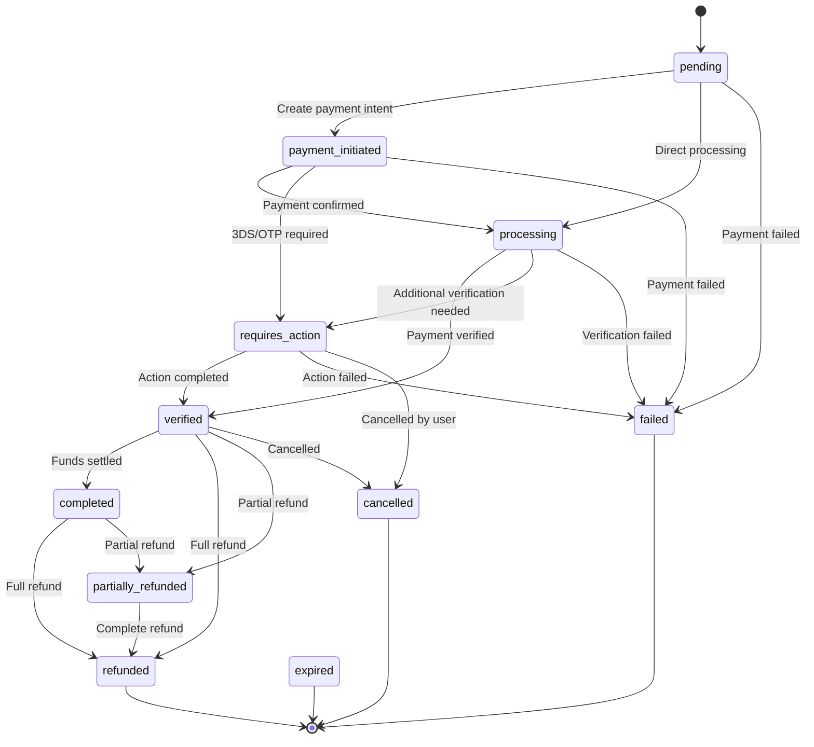
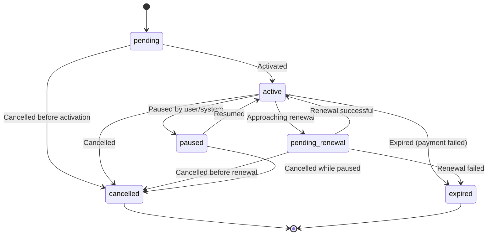
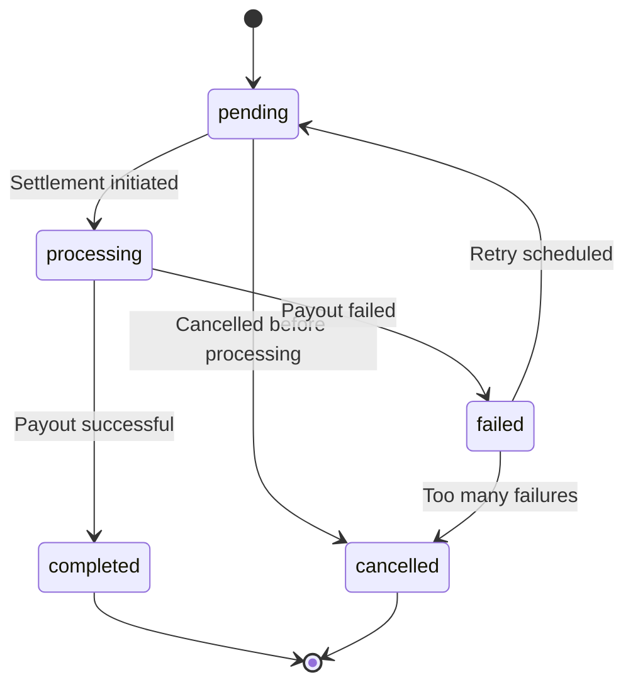
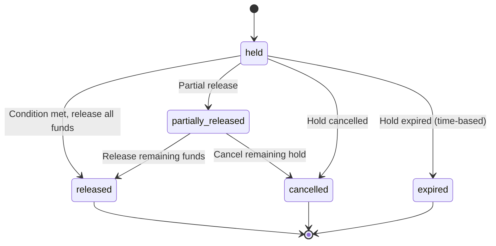
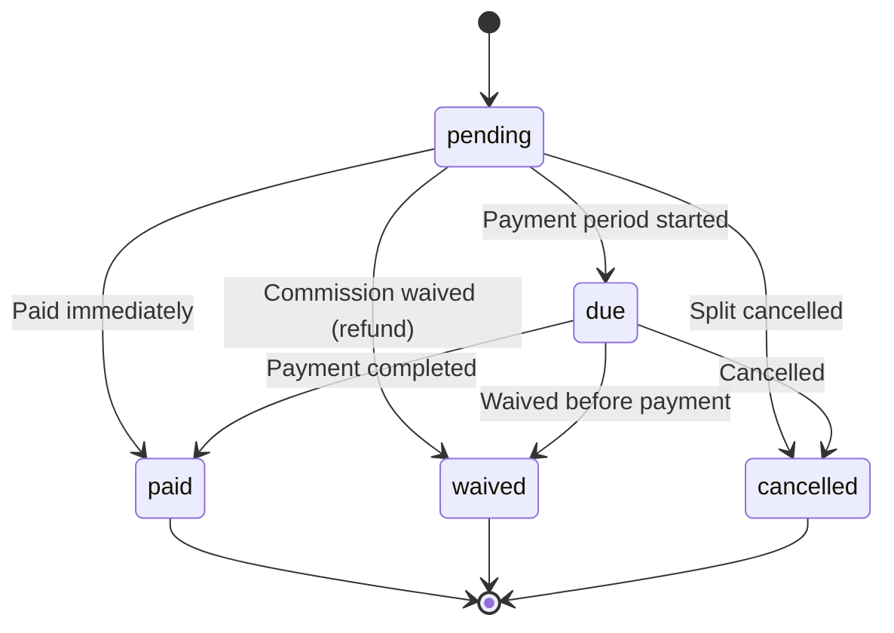

# State Machine Architecture

@classytic/revenue implements enterprise-grade state machines for all entities to ensure data integrity and prevent invalid state transitions.

## Transaction State Machine



**Terminal States:** `refunded`, `failed`, `cancelled`, `expired`

**Typical Flow:**
1. `pending` - Transaction created
2. `payment_initiated` - Payment intent created with gateway
3. `processing` - Payment confirmed, being verified
4. `verified` - Payment verified, awaiting settlement
5. `completed` - Funds settled, transaction finalized

## Subscription State Machine



**Terminal States:** `cancelled`, `expired`

**Typical Flow:**
1. `pending` - Subscription created
2. `active` - Subscription activated
3. `pending_renewal` - Approaching renewal date
4. `active` - Renewed successfully (cycles back)

## Settlement State Machine



**Terminal States:** `completed`, `cancelled`

**Retry Logic:** Failed settlements can be retried by transitioning back to `pending`.

## Escrow Hold State Machine



**Terminal States:** `released`, `cancelled`, `expired`

**Use Case:** Hold funds in escrow until conditions are met (e.g., delivery confirmation).

## Split Payment State Machine



**Terminal States:** `paid`, `waived`, `cancelled`

**Use Case:** Track platform fees, affiliate commissions, and revenue splits.

---

## Implementation Details

### Automatic Validation

All service methods automatically validate state transitions:

```typescript
// ✅ Valid transition
await revenue.payments.verify(transaction._id);
// pending → processing → verified

// ❌ Invalid transition (throws InvalidStateTransitionError)
await revenue.payments.verify(completedTransaction._id);
// Error: Cannot transition from 'completed' to 'verified'
```

### State Machine Methods

Each state machine provides these methods:

```typescript
// Check if transition is valid (non-throwing)
TRANSACTION_STATE_MACHINE.canTransition('pending', 'processing'); // true
TRANSACTION_STATE_MACHINE.canTransition('completed', 'pending'); // false

// Validate transition (throws if invalid)
TRANSACTION_STATE_MACHINE.validate('pending', 'processing', 'tx_123');

// Get allowed next states
TRANSACTION_STATE_MACHINE.getAllowedTransitions('verified');
// ['completed', 'refunded', 'partially_refunded', 'cancelled']

// Check if state is terminal
TRANSACTION_STATE_MACHINE.isTerminalState('refunded'); // true
TRANSACTION_STATE_MACHINE.isTerminalState('pending'); // false

// Create audit event with validation
const event = TRANSACTION_STATE_MACHINE.validateAndCreateAuditEvent(
  'pending',
  'verified',
  'tx_123',
  { changedBy: 'admin', reason: 'Verified payment' }
);
```

### Custom State Machines

You can create custom state machines for your domain:

```typescript
import { StateMachine } from '@classytic/revenue';

const ORDER_STATE_MACHINE = new StateMachine(
  new Map([
    ['draft', new Set(['submitted', 'cancelled'])],
    ['submitted', new Set(['processing', 'cancelled'])],
    ['processing', new Set(['completed', 'failed'])],
    ['completed', new Set([])], // Terminal
    ['failed', new Set(['submitted'])], // Can retry
    ['cancelled', new Set([])], // Terminal
  ]),
  'order' // Resource type for errors
);

// Use like built-in state machines
ORDER_STATE_MACHINE.validate('draft', 'submitted', 'order_123');
```

---

## Best Practices

### 1. Always validate before state changes
```typescript
// ❌ Bad - no validation
transaction.status = 'completed';
await transaction.save();

// ✅ Good - validate first
TRANSACTION_STATE_MACHINE.validate(
  transaction.status,
  'completed',
  transaction._id.toString()
);
transaction.status = 'completed';
await transaction.save();
```

### 2. Use audit trail for accountability
```typescript
import { appendAuditEvent } from '@classytic/revenue';

// Create audit event
const event = TRANSACTION_STATE_MACHINE.validateAndCreateAuditEvent(
  transaction.status,
  'completed',
  transaction._id.toString(),
  {
    changedBy: userId,
    reason: 'Payment verified',
    metadata: { ipAddress: req.ip }
  }
);

// Apply state change with audit
transaction.status = 'completed';
Object.assign(transaction, appendAuditEvent(transaction, event));
await transaction.save();
```

### 3. Check terminal states before operations
```typescript
if (TRANSACTION_STATE_MACHINE.isTerminalState(transaction.status)) {
  throw new Error('Cannot modify completed transaction');
}
```

### 4. Query allowed transitions for UI
```typescript
// Get available actions for current state
const actions = TRANSACTION_STATE_MACHINE.getAllowedTransitions(
  transaction.status
);

// Render UI buttons based on allowed transitions
return {
  canRefund: actions.includes('refunded'),
  canComplete: actions.includes('completed'),
  canCancel: actions.includes('cancelled'),
};
```

---

## Error Handling

State transition errors are thrown as `InvalidStateTransitionError`:

```typescript
import { InvalidStateTransitionError } from '@classytic/revenue';

try {
  await revenue.payments.verify(transaction._id);
} catch (error) {
  if (error instanceof InvalidStateTransitionError) {
    console.error(
      `Cannot transition ${error.fromState} → ${error.toState} ` +
      `for ${error.resourceType} ${error.resourceId}`
    );
  }
}
```

---

## References

- [State Machine Implementation](../../src/core/state-machine/definitions.ts)
- [Error Types](../../src/core/errors.ts)
